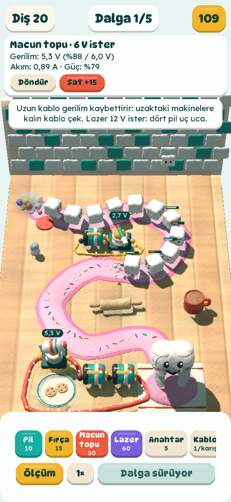
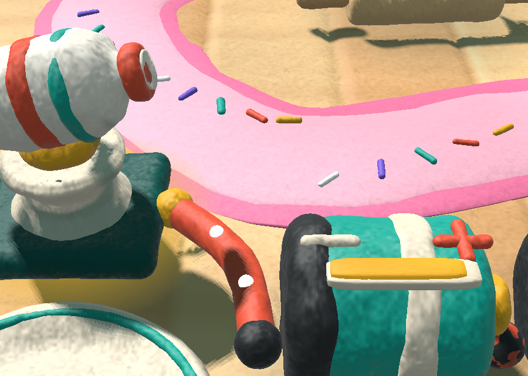

# Macun Kalesi (Tooth Fort)

Mutfak tezgâhında şekerler dişe saldırıyor. Diş fırçası, macun topu ve beyazlatıcı lazer dişi
koruyor, ama hepsi elektrikle çalışıyor ve devreyi sen kuruyorsun: parçaları tezgâhın istediğin
yerine koyuyor, kabloları parmağınla çiziyorsun. Pilleri uç uca yapıştırırsan (seri) gerilim artar,
yan yana bağlarsan (paralel) piller uzun dayanır. Uzun ve ince kablo gerilim kaybettirir; fazla
gerilim makineyi yakar. Arkada gerçek bir devre çözücü var.

Toyquaise'in öğretici oyunu. LibGDX + Kotlin ile yazılmış, 3D oyun hamuru görünümünde; hedef
Android. Arayüz Türkçe. Tasarım belgesi: [docs/TASARIM.md](docs/TASARIM.md).

<p>
  
  
</p>

## Çalıştırmak

JDK 17 ya da üstü yeter; Gradle kendini indirir.

```bash
./gradlew :lwjgl3:run          # masaüstü penceresi (telefon gibi dik)
./gradlew :logic:test          # devre çözücü ve oyun kuralları testleri
./gradlew :lwjgl3:dist         # tek dosyalık çalıştırılabilir jar: lwjgl3/build/libs/
./gradlew :android:assembleDebug   # APK: android/build/outputs/apk/debug/ (Android SDK gerekir)
```

Android Studio ile projeyi açmak yeterli. Android SDK yoksa (`ANDROID_HOME` ya da
`local.properties` içinde `sdk.dir`) `:android` modülü atlanır; masaüstü ve testler yine derlenir.

### Geliştirirken

```bash
# Bölüm 2'yi aç, örnek bir savunma kur, dalganın 9 saniyesini oynat, ekran görüntüsü al ve çık:
./gradlew :lwjgl3:run --args="--level 2 --demo --seconds 9 --screenshot $PWD/shot.png"
# Bir kareye yakından bak (modelleri denetlemek için), arayüz olmadan:
./gradlew :lwjgl3:run --args="--level 2 --demo --close-up 3,3 --no-hud"
# Pencere boyutu: --size 1080x2340
# Dokunuşları sırayla oynat (kontrolleri denemek için): bkz. Options.script
java -jar lwjgl3/build/libs/toothfort-0.1.0.jar --level 2 --screenshot $PWD/s.png \
  --script "tool battery; down 2.4 3.2; up 2.4 3.2; tool battery; down 3.35 3.28; up 3.35 3.28; wait 10; shot"
```

Ekranı olmayan bir makinede: `xvfb-run -a ./gradlew :lwjgl3:run --args="..."`.

## Nasıl oynanır

1. Aşağıdaki kutudan bir parça seç (Pil, Fırça…) ve tezgâha dokun. Parmağını kaldırana kadar
   parça parmağının altında süzülür; yeşil halka "konur", kırmızı halka "konmaz" demektir.
   Seçili parçanın kartındaki **Döndür** onu sekizde bir tur çevirir.
2. Bir pili ötekinin ucuna yaklaştır: uçlar yapışır. + ile − yapışırsa seri bağlanmış olur.
3. **Kablo**yu seç, bir parçanın + ya da − ucundan başlayıp parmağını sürükle, başka bir uçta
   bırak. Boşlukta bırakırsan bir klips konur; kablolar orada birleşir. Pilin + ucu mercan, − ucu
   kömür renginde, makinelerin uçları sarı.
4. Devre kapanınca kablolarda akım boncukları akar ve makinenin üstünde gerçek gerilim yazar:
   yeşil yeterli, sarı az, mercan fazla.
5. **Dalgayı başlat.** Zaman yalnızca dalga sırasında akar: piller boşalır, makineler ısınır.
   Kurarken her şey parasız geri alınır.

## Proje yapısı

```
logic/    oyunun kuralları, LibGDX'siz düz Kotlin; JVM'de test edilir
  circuit/Network.kt    düğüm analiziyle devre çözücü (Kirchhoff akım yasası)
  board/Board.kt        tezgâh: serbest konumlu parçalar, uç uca yapışma, klipsler, kablolar → devre;
                        pil, ısı, erime, sigorta
  board/Parts.kt        parçalar, kablo kalınlıkları, elektrik sabitleri
  game/Level.kt         şurup izi, mutfak eşyaları, düşmanlar, dalgalar, bölümler
  game/Game.kt          oyun döngüsü, makinelerin saldırısı, para
core/     LibGDX: 3D hamur görünümü, dokunma, arayüz
  render/ClayRenderer.kt   gölge haritası ve hamur gölgelendiricisi (assets/shaders/clay.*)
  render/MeshData.kt       top, yuvarlatılmış kutu, döndürülmüş şekil, rulo; hepsi yoğrulur
  render/Kitchen.kt        şurup izi ve kablolar
  render/Models.kt         bütün modeller (pil, fırça, macun topu, lazer, şekerler, diş, mutfak…)
  render/WorldView.kt      sahne, mıncıklama yayları, canlandırma, parçacıklar
  PlayScreen.kt            kamera, parmakla yerleştirme ve kablo çizme, ölçüm etiketleri
  ui/                      arayüz (DynaPuff ve Lexend), metinler
lwjgl3/   masaüstü başlatıcı (geliştirme, ekran görüntüleri)
android/  Android başlatıcı (com.toyquaise.toothfort)
assets/   yazı tipleri ve gölgelendiriciler (masaüstü ve Android ortak)
docs/     tasarım belgesi ve görseller
```

Sürümler `gradle/libs.versions.toml` içinde: LibGDX 1.14.2, Kotlin 2.4.20, Android Gradle
eklentisi 9.4.1, Gradle 9.8.

## Yol haritası

- Bölüm 4: sigorta ve direnç (parçalar ve testleri hazır). Kola şekeri kısa devre yaptırır.
- Kondansatör (dev macun atışı) ve lolipop canavarı; jeneratör, transformatör, diyot, transistör.
- Sakız (kabloyu koparır), teneke kutu (elektromıknatıs).
- Ses: fırça vızıltısı, macun "plop"u, kısa devre çıtırtısı.
- İngilizce metinler, bölüm seçme ekranı, kayıt.
- Mağaza için simge ve görseller; toyquaise.com'a proje sayfası.

## Lisanslar

DynaPuff ve Lexend yazı tipleri SIL Open Font License 1.1 ile dağıtılır
(`assets/fonts/*-OFL.txt`). Oyunun kodu, görselleri ve metinleri Toyquaise'e aittir.
