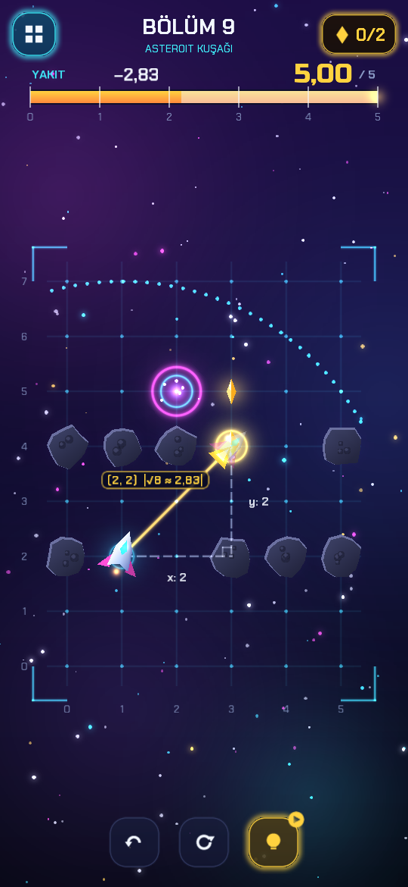
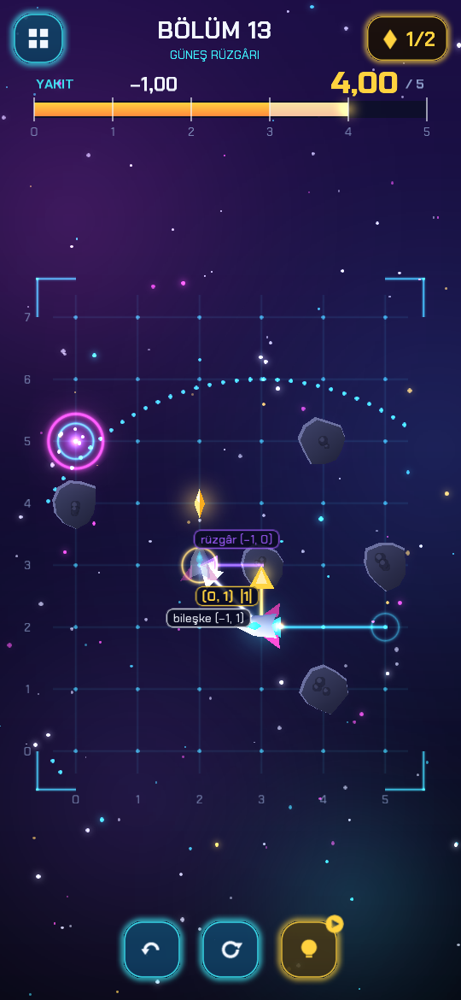
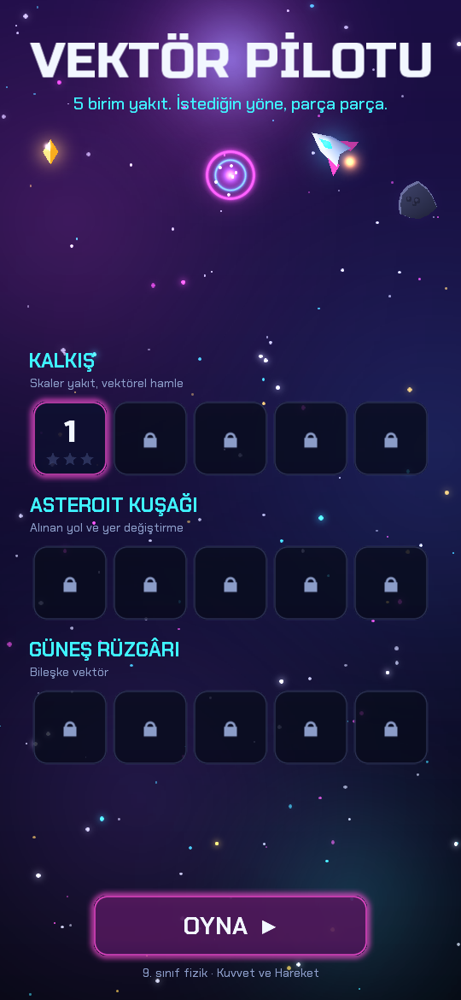

# Vektör Pilotu

Neon ışıklı bir uzayda küçük bir gemi var; elinde **5 birim yakıt**. Gemiden parmağını
sürükleyip bırakarak istediğin yöne, istediğin uzunlukta vektörler çekiyorsun. Her parça kendi
büyüklüğü kadar yakıt yakıyor: (2, 1) için √5 ≈ 2,24 birim. Asteroitlerin arasından geçip
kristalleri topluyor ve portala ulaşıyorsun. Güneş rüzgârı bölümlerinde rüzgâr her hamleye
bedava eklenir.

9. sınıf fizik, **Kuvvet ve Hareket** ünitesi için Toyquaise'in öğretici oyunu. Konular skaler
ve vektörel nicelikler, vektör toplama, bileşenler, alınan yol ve yer değiştirme. LibGDX ve
Kotlin ile yazıldı. Hedef Android; reklamlar AdMob ile. Arayüz Türkçe.

- Tasarım belgesi: [docs/TASARIM.md](docs/TASARIM.md)

<p>
  
  
  
</p>

## Çalıştırmak

JDK 17 ya da üstü yeter; Gradle kendini indirir.

```bash
./gradlew :lwjgl3:run              # masaüstü penceresi (telefon gibi dik)
./gradlew :logic:test              # kurallar, çözücü ve bölüm testleri
./gradlew :lwjgl3:dist             # tek dosyalık jar: lwjgl3/build/libs/
./gradlew :android:assembleDebug   # APK: android/build/outputs/apk/debug/ (Android SDK gerekir)
```

Android Studio ile projeyi açmak yeterli. Android SDK yoksa `:android` modülü atlanır;
masaüstü ve testler yine derlenir. SDK'yı `ANDROID_HOME` ya da `local.properties` içindeki
`sdk.dir` gösterir.

### Geliştirirken

```bash
java -jar lwjgl3/build/libs/vektorpilotu-0.1.0.jar --level 13 --steps 1 --aim-hint
```

Bu komut 13. bölümü açar. İpucuyla bir hamle yapar ve sıradakini nişanlanmış gösterir.

| Seçenek | Ne yapar |
|---|---|
| `--level N` | Başlık ekranı yerine N. bölümü açar |
| `--steps K` | İpucuyla K hamle yapar |
| `--aim X,Y` | (X, Y) hamlesini nişanlanmış gösterir |
| `--aim-hint` | İpucunun hamlesini nişanlanmış gösterir |
| `--finish` | Bölümü bitirir, bölüm sonu panelini gösterir |
| `--screenshot DOSYA` | Ekran görüntüsü kaydedip çıkar; ilerleme kaydedilmez |
| `--size 540x1170` | Pencere boyutu |
| `--no-hud` | Yalnızca harita |
| `--autoplay` | Bölümü ipuçlarıyla kendi kendine oynar |
| `--record KLASÖR` | Her kareyi (saniyede 30) kaydeder, sonra çıkar; `--seconds S` ne kadar süreceğini söyler |

Ekranı olmayan bir makinede: `xvfb-run -a java -jar ...`.

Tanıtım videosu:

```bash
java -jar lwjgl3/build/libs/vektorpilotu-0.1.0.jar --size 540x1170 --level 13 --autoplay --record kareler --seconds 16
ffmpeg -framerate 30 -i kareler/frame%04d.png -c:v libx264 -pix_fmt yuv420p tanitim.mp4
```

Yeni bölüm adayları üretmek için:

```bash
GENERATE=1 ./gradlew :logic:test --tests '*GeneratorTest*' --rerun-tasks
```

Adaylar `logic/build/candidates.txt` dosyasına yazılır.

## AdMob

- **Debug sürümleri** her zaman Google'ın test kimliklerini kullanır.
- **Release sürümü** gerçek kimlikleri Gradle özelliklerinden alır. Bunları
  `~/.gradle/gradle.properties` dosyasına koy; depoya koyma:

  ```properties
  admob.appId=ca-app-pub-XXXXXXXXXXXXXXXX~YYYYYYYYYY
  admob.interstitial=ca-app-pub-XXXXXXXXXXXXXXXX/ZZZZZZZZZZ
  admob.rewarded=ca-app-pub-XXXXXXXXXXXXXXXX/WWWWWWWWWW
  ```

Reklamların nerede ve ne sıklıkta çıktığı:

- İpucu düğmesinde ödüllü video.
- Bölüm aralarında, seyrek geçiş reklamı.
- Banner yok.
- Avrupa için onay formu (UMP).

### Yayından önce

- [ ] AdMob'da uygulamayı ve iki reklam birimini (geçiş, ödüllü) aç; kimlikleri yukarıdaki gibi ver.
- [ ] AdMob'da "Gizlilik ve mesajlaşma" altında GDPR mesajını oluştur.
- [ ] Bir gizlilik politikası sayfası yayımla ve `app-ads.txt` dosyasını sitende yayımla.
- [ ] Play Console'da hedef kitleyi "13 yaş ve üstü" seç; reklam ve veri güvenliği formlarını doldur.
- [ ] Release imzası için bir anahtar oluştur. Anahtar dosyaları `.gitignore`'da.

## Proje yapısı

```
logic/    kurallar, LibGDX'siz düz Kotlin; JVM'de test edilir
  Vec.kt        tam sayılı vektörler
  Level.kt      harita, kısımlar (kazanımlar), asteroitler ve kristaller
  Flight.kt     oynanan bölüm: yakıt, hamleler, rüzgâr, geri alma, yıldızlar
  Solver.kt     Dijkstra: en çok kristal, en az yakıt; ipuçları
  Levels.kt     15 bölüm
  AdPacing.kt   geçiş reklamının sıklığı
core/     LibGDX: neon çizim, ekranlar, arayüz
  gfx/Gfx.kt        parlayan çizgi, ok, halka, ışık; çokgenler
  gfx/Sprites.kt    gemi, asteroit, kristal, portal
  gfx/Starfield.kt  uzay arka planı
  PlayScreen.kt     harita, nişan alma, uçuş, yakıt göstergesi, bölüm sonu
  MenuScreen.kt     başlık ve bölümler
  ui/               yazı tipleri (Russo One, Chakra Petch), paneller, simgeler, metinler
lwjgl3/   masaüstü başlatıcı (geliştirme, ekran görüntüleri, video)
android/  Android başlatıcı ve AdMob (com.toyquaise.vektorpilotu)
assets/   yazı tipleri
docs/     tasarım belgesi ve görseller
```

Sürümler `gradle/libs.versions.toml` içinde.

## Lisanslar

Russo One ve Chakra Petch yazı tipleri SIL Open Font License 1.1 ile dağıtılır
(`assets/fonts/*-OFL.txt`). Oyunun kodu, görselleri ve metinleri Toyquaise'e aittir.
