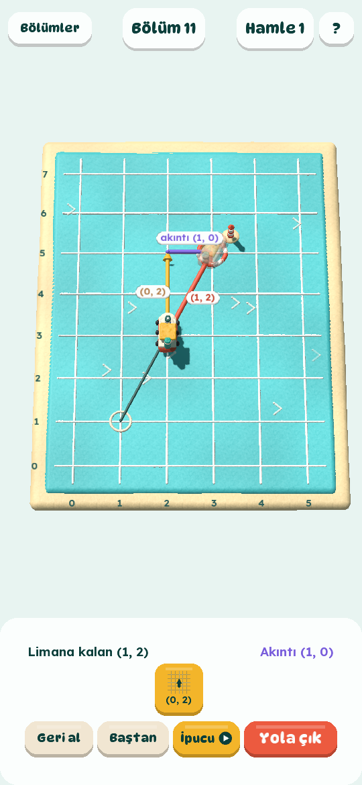
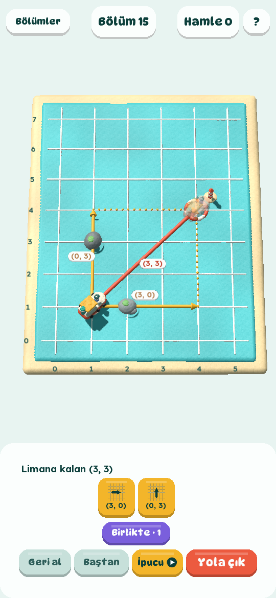

# Hamur Kaptan

Kareli bir denizde hamurdan bir römorkör var; onu vektör kartlarıyla limana götürüyorsun. Kartlar
uç uca eklenir. ×2, ×½ ve ×(−1) jetonları kartı bir gerçek sayıyla çarpar. Akıntı her hamleye
kendi vektörünü ekler. Ayır, eğik bir kartı bileşenlerine böler. Birlikte, iki römorkörü aynı
anda çektirir; tekne paralelkenarın köşegeninden gider. Bölüm sonunda alınan yol ile yer
değiştirme yan yana yazar.

9. sınıf fizik, **Kuvvet ve Hareket** ünitesi (Maarif Modeli FİZ.9.2.3 ve FİZ.9.2.4) için
Toyquaise'in öğretici oyunu. LibGDX ve Kotlin ile yazıldı, 3D oyun hamuru görünümünde. Hedef
Android; reklamlar AdMob ile. Arayüz Türkçe.

- Tasarım belgesi: [docs/TASARIM.md](docs/TASARIM.md)

<p>
  
  
  
</p>

## Çalıştırmak

JDK 17 ya da üstü yeter; Gradle kendini indirir.

```bash
./gradlew :lwjgl3:run              # masaüstü penceresi (telefon gibi dik)
./gradlew :logic:test              # kurallar, çözücü ve bölüm testleri
./gradlew :lwjgl3:dist             # tek dosyalık jar: lwjgl3/build/libs/
./gradlew :android:assembleDebug   # APK: android/build/outputs/apk/debug/ (Android SDK gerekir)
```

Android Studio ile projeyi açmak yeterli. Android SDK yoksa `:android` modülü atlanır;
masaüstü ve testler yine derlenir. SDK'yı `ANDROID_HOME` ya da `local.properties` içindeki
`sdk.dir` gösterir.

### Geliştirirken

```bash
java -jar lwjgl3/build/libs/hamurkaptan-0.1.0.jar --level 11 --steps 1 --preview
```

Bu komut 11. bölümü açar. İpucuyla bir hamle yapar ve sıradaki hamlenin oklarını gösterir.

| Seçenek | Ne yapar |
|---|---|
| `--level N` | Bölüm listesi yerine N. bölümü açar |
| `--steps K` | İpucuyla K hamle yapar |
| `--preview` | Sıradaki hamleyi seçer, okları görünür |
| `--pick I` | Eldeki I. kartı seçer (0'dan başlar) |
| `--finish` | Bölümü bitirir, bölüm sonu kartını gösterir |
| `--screenshot DOSYA` | Ekran görüntüsü kaydedip çıkar; ilerleme kaydedilmez |
| `--size 540x1170` | Pencere boyutu |
| `--no-hud` | Yalnızca 3D deniz |

Ekranı olmayan bir makinede: `xvfb-run -a java -jar ...`.

## AdMob

- **Debug sürümleri** her zaman Google'ın test kimliklerini kullanır.
- **Release sürümü** gerçek kimlikleri Gradle özelliklerinden alır. Bunları
  `~/.gradle/gradle.properties` dosyasına koy; depoya koyma:

  ```properties
  admob.appId=ca-app-pub-XXXXXXXXXXXXXXXX~YYYYYYYYYY
  admob.interstitial=ca-app-pub-XXXXXXXXXXXXXXXX/ZZZZZZZZZZ
  admob.rewarded=ca-app-pub-XXXXXXXXXXXXXXXX/WWWWWWWWWW
  ```

  Özellikler yoksa release sürümü de test kimlikleriyle derlenir.

Reklamların nerede ve ne sıklıkta çıktığı tasarım belgesinde anlatılıyor:

- İpucu düğmesinde ödüllü video.
- Bölüm aralarında, seyrek geçiş reklamı.
- Banner yok.
- Avrupa için onay formu (UMP).
- Reklam içeriği en çok PG düzeyinde.

### Yayından önce

- [ ] AdMob'da uygulamayı ve iki reklam birimini (geçiş, ödüllü) aç; kimlikleri yukarıdaki gibi ver.
- [ ] AdMob'da "Gizlilik ve mesajlaşma" altında GDPR mesajını oluştur.
- [ ] Bir gizlilik politikası sayfası yayımla. Play Console bunu ister.
- [ ] `app-ads.txt` dosyasını sitende yayımla.
- [ ] Play Console'da hedef kitleyi "13 yaş ve üstü" seç. Reklam içerdiğini ve veri güvenliği
      formunu (AdMob'un topladıkları) doldur.
- [ ] Release imzası için bir anahtar oluştur. Anahtar dosyaları `.gitignore`'da.

## Proje yapısı

```
logic/    kurallar, LibGDX'siz düz Kotlin; JVM'de test edilir
  Vec.kt        tam sayılı vektörler, çarpanlar (×2, ×½, ×−1), jetonlar
  Level.kt      deniz haritası, kısımlar (kazanımlar), kayalar ve deniz sınırı
  Voyage.kt     oynanan bölüm: hamleler, ayırma, birlikte çekme, geri alma, yıldızlar
  Solver.kt     en iyi yol (en az hamle, sonra en kısa yol); ipuçları
  Levels.kt     16 bölüm
  AdPacing.kt   geçiş reklamının sıklığı
core/     LibGDX: 3D hamur görünümü, ekranlar, arayüz
  render/ClayRenderer.kt  gölge haritası ve hamur gölgelendiricisi (assets/shaders/clay.*)
  render/MeshData.kt      top, yuvarlatılmış kutu, döndürülmüş şekil, rulo; hepsi yoğrulur
  render/Models.kt        römorkör, kayalar, can simidi ve fener, oklar, kareli deniz
  render/SeaView.kt       deniz, tekne, rota, önizleme okları, akıntı, parçacıklar
  PlayScreen.kt           bir bölüm: kamera, okların etiketleri, eksen sayıları
  MenuScreen.kt           bölüm listesi ve yıldızlar
  ui/                     arayüz (DynaPuff ve Lexend), metinler
lwjgl3/   masaüstü başlatıcı (geliştirme, ekran görüntüleri)
android/  Android başlatıcı ve AdMob (com.toyquaise.hamurkaptan)
assets/   yazı tipleri ve gölgelendiriciler (masaüstü ve Android ortak)
docs/     tasarım belgesi ve görseller
```

Sürümler `gradle/libs.versions.toml` içinde.

## Lisanslar

DynaPuff ve Lexend yazı tipleri SIL Open Font License 1.1 ile dağıtılır
(`assets/fonts/*-OFL.txt`). Oyunun kodu, görselleri ve metinleri Toyquaise'e aittir.
